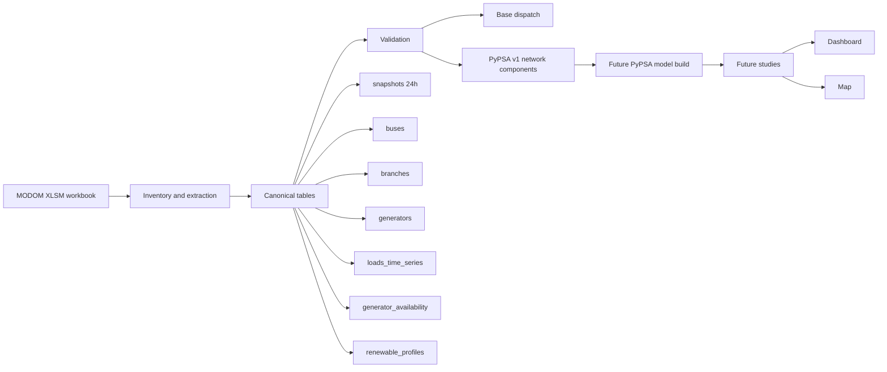

# modom-pypsa

Reproducible workflow for transforming daily `MODOM` cases into canonical power-system tables, PyPSA-ready network inputs, and future study outputs such as dashboards and geospatial result maps for Dominican SENI analysis.

## Project objective

This repository exists to turn an operational `MODOM` workbook into a traceable engineering pipeline that can later support:

- reproducible PyPSA model building
- base dispatch replication
- network-constrained studies
- dashboard-style study summaries
- map-based visualization of buses, branches, generators, and study results

The design principle is strict:

- `MODOM` workbook is the source
- canonical tables are the stable interface
- PyPSA, dashboards, and maps consume the canonical layer, not the raw workbook

## What the project already does

Implemented and working blocks:

- workbook inventory from `.xlsm` without Excel or VBA execution
- canonical `snapshots`
- canonical `buses`
- canonical `branches`
- canonical `generators`
- canonical `loads_time_series`
- canonical `generator_availability`
- canonical `renewable_profiles`
- first `copperplate` dispatch
- first `PyPSA v1` export of `lines` and `transformers`
- first real `pypsa.Network()` builder with a network-constrained linear LOPF
- real substation coordinates scraped from the OC Power BI map and joined to buses
- self-contained HTML dashboard (map + fuel mix + nodal prices + congestion)
- regression tests based on synthetic workbook fixtures

Current engineering status:

- canonical time axis for `v1`: `24h`
- `48`-period operational horizon preserved as a secondary source layer
- network topology already structured
- branch semantics partially interpreted
- bus nominal voltage inference already available for a large subset of the network

## End goal

The intended end state is not just a script collection. The intended end state is a study workflow:

1. ingest a `MODOM` daily case
2. build canonical tables
3. validate structural and electrical consistency
4. build a PyPSA model
5. run studies
6. export results to tables
7. present results in:
   - a dashboard
   - a network map
   - reproducible technical summaries

## Workflow at a glance



## Current repository structure

```text
modom-pypsa/
├── configs/                         # project configuration notes
├── data/
│   ├── raw/                         # reference MODOM source inputs tracked in this repo
│   └── processed/                   # generated canonical outputs tracked in this repo
├── docs/                            # technical design, mapping, and validation notes
├── results/
│   └── dispatch_basecase/           # curated tracked example outputs
├── scripts/                         # CLI entrypoints for each pipeline step
├── src/modom_pypsa/                 # core library code
├── tests/                           # regression tests and synthetic fixtures
├── .gitignore
├── pyproject.toml
└── README.md
```

## Canonical pipeline

The current intended execution order is:

1. `inventory`
   - inspect workbook structure
   - export stable previews
   - identify relevant source sheets
2. `transform`
   - build canonical tables from source sheets
   - reconcile identifiers and topology
3. `validate`
   - check structural consistency
   - expose unresolved modeling gaps
4. `dispatch`
   - run a first reproducible `copperplate` base dispatch
5. `build_pypsa`
   - export structured network components
   - assemble and solve a real `pypsa.Network()` (network-constrained linear LOPF)
6. `visualize`
   - future dashboard and map layers built from canonical data and study outputs

## Canonical tables already implemented

Current core tables:

- `snapshots`
- `buses`
- `branches`
- `generators`
- `loads_time_series`
- `generator_availability`
- `renewable_profiles`

Current PyPSA-facing intermediate export:

- `lines_v1`
- `transformers_v1`
- `excluded_branches_v1`

These are generated under `data/processed/` and documented in [`docs/`](./docs).

## Key modeling decisions already fixed

### 1. Time-axis decision

Real `V449` evidence shows that `MODOM` mixes two temporal layers:

- `24` hourly blocks in `PDemanda`
- `24` hourly blocks in `Despacho Potencia`
- `48` periods in `e_sets`
- `48` periods in `S_FLUJO`, `VOLTAJE`, `Reporte de Disponibilidad`, and `Pronostico Renovable`

Key finding (confirmed from raw `Pronostico Renovable`): the **`48` periods are two
days of 24 hours** (the MODOM 48-hour horizon, `e_sets` N=1*48), **not** half-hours.
Each 24-block carries its own diurnal solar bell.

Current `v1` decision:

- canonical axis = `24h`, aligned to `PDemanda` (one operational day)
- the time-varying generator series (`Reporte de Disponibilidad`,
  `Pronostico Renovable`) take **day 1 = the first 24 periods**
  (`time_alignment_method = first_day_24_of_48`), so solar peaks at midday
- day 2 of the horizon remains available in the source for a future 48-hour model

This corrected an earlier bug where the 48→24 reduction averaged consecutive pairs
(treating them as half-hours), which merged the two daily solar bells into a false
double peak (≈h_07 and h_19) with zero at real midday.

### 2. Generator cost handling

The workflow already distinguishes:

- raw `cvp`
- effective inferred `cvp`
- audited cases still unresolved

Important finding:

- `technology_group = 4` in `MODOM` is not treated as automatically renewable
- cost-zero heuristics are only allowed when the unit name clearly indicates a variable renewable technology

### 3. Branch semantics handling

The workflow already distinguishes:

- normal series branches
- transformer-like branches with tap-like values
- auxiliary `TAP` links
- excluded v1 cases

`closure_flag` is no longer treated as a simple binary switch everywhere.

### 4. Bus nominal voltage handling

The workflow already infers `v_nom_kv` conservatively using:

- explicit voltage in bus names
- suffix heuristics where evidence is strong
- limited topology consensus where safe

## What is already validated in the real case

The current real-case workflow can already validate:

- canonical `24h` snapshot set
- bus inventory and reconciliation
- branch topology
- generator inventory and availability
- first bus nominal voltage layer
- first PyPSA-oriented branch component split
- first dispatch input consistency

Current validated real-case indicators include:

- no missing bus references in generators
- no effective `pmax < pmin`
- branch topology available
- first `lines_v1` and `transformers_v1` already exported

## Latest real-case status

As of the current repository state:

- buses: `717`
- buses with `v_nom_kv`: `603`
- buses without `v_nom_kv`: `114`
  - `50` classified as `generator_terminal` (LV generator bus, `v_nom` intentionally absent in `MODOM`)
  - `64` still classified as `network` (genuine residual)
- branches: `846`
- branches included in `PyPSA v1`: `753`
- branches excluded in `PyPSA v1`: `93`
- `lines_v1`: `592`
- `transformers_v1`: `161`
- transformers with `tap_ratio_hint`: `6`

Current branch voltage audit:

- `lines_v1`
  - `same_voltage_ok = 583`
  - `line_voltage_mismatch = 4`
  - `missing_bus_v_nom = 5`
- `transformers_v1`
  - `different_voltage_ok = 48`
  - `same_voltage_transformer_suspect = 1`
  - `missing_bus_v_nom = 112`

Current base dispatch result (copperplate, single snapshot, no network):

- snapshot: `h_01`
- total load: `3288.904 MW`
- dispatched total: `3288.904 MW`
- unserved load: `0 MW`
- spare available capacity: `1706.115 MW`

## PyPSA network v1 result (network-constrained linear LOPF)

The first real `pypsa.Network()` (24 snapshots, 717 buses, 753 branches, 140
generators) solves to optimality and, unlike the copperplate, exposes network
congestion:

- total load: `75421.329 MWh`
- served: `74392.481 MWh`
- unserved (load shedding from congestion): `1028.847 MWh` (`~1.4%`)
- peak load: `3553.323 MW`
- lines at `>=90%` loading at their peak snapshot: `22`
- max line loading: `1.0` (binding thermal limits)

Key modeling choices for v1 are documented in
[`docs/pypsa_network.md`](./docs/pypsa_network.md). In short: all buses use
`v_nom = 1.0` (per-unit common base, since MODOM impedances are already per-unit),
lines and transformers are added as series `Line` components, and a costly
`unserved` generator per demand bus guarantees feasibility and yields a per-node
load-shedding KPI. The unserved energy reflects provisional impedance/thermal
inputs and is an analytical signal, not a final operational conclusion.

## What this repository is for in local continuation

If you pull this repository locally, it already contains:

- the codebase
- the transformation logic
- the validation logic
- the public documentation
- the test suite
- a tracked example of base dispatch outputs in `results/dispatch_basecase/`

This means you can continue local development of:

- canonical data model improvements
- PyPSA model build scripts
- dashboard backends and frontends
- map layers for study visualization
- result post-processing
- additional tests and validation workflows

## Repository data mode

At the current repository stage, the project is prepared so local continuation
after `git pull` is practical.

This repository now carries:

- the reference `MODOM` workbook under `data/raw/`
- the generated canonical outputs under `data/processed/`
- tracked base dispatch outputs under `results/dispatch_basecase/`
- the scripts, code, tests, and documentation needed to continue development

That means a local clone or pull can start from a materially complete working
state instead of an empty data directory.

## Can you continue locally?

Yes, **it is possible**, and the repository is now structured to make that much
easier.

After pulling the repository locally, you already receive:

- the current codebase
- the reference workbook stored in `data/raw/`
- the current processed artifacts stored in `data/processed/`
- tracked dispatch example outputs

You can either:

- continue directly from the tracked artifacts
- or rebuild everything locally from the tracked workbook

## Actualizar los datos con un caso nuevo (guía para el agente)

> Esta sección está escrita para que un agente recargue los datos desde cero cuando
> llegue un **caso nuevo del MODOM** (u otra fecha). Explica las **fuentes**, dónde
> va cada una y en qué **orden** correr los scripts.

### Fuentes necesarias

| # | Fuente | De dónde sale | Dónde colocarla | Alimenta | ¿Requerida? |
|---|--------|---------------|-----------------|----------|-------------|
| 1 | **Caso MODOM** (`.xlsm`) | Workbook diario del SENI (PowerFactory/DIgSILENT) | `data/raw/` | Toda la capa canónica, el despacho y la red PyPSA | **Sí** (núcleo) |
| 2 | **Ubicaciones del mapa Power BI del OC** | Reporte público "Ubicación" del OC (se **scrapea**, no se descarga a mano) | se genera en `data/external/oc_smc_points.csv` | Coordenadas lat/lon de las barras → mapa del dashboard | Sí, para el **mapa geográfico** |
| 3 | **PDF de transacciones económicas** (`OC-GC-07-IMTE-*.pdf`) | Informe mensual del OC | (opcional) `data/external/` | **Auxiliar**: puente `PUNTO → ID SMC → barra` (Tabla 19) para validar/ampliar el cruce de coordenadas | No (validación) |
| 4 | **Unifilar del SENI** (`*UNIFILAR SENI*.pdf`) | Diagrama unifilar mensual del OC | (opcional) `data/external/` | **Combustible por central** (ya usado para clasificar la mezcla); a futuro: impedancias de transformadores (Ucc%+MVA) y líneas (longitud+conductor) | Parcial (mejora fidelidad) |
| 5 | **Plano geográfico de transmisión** (`*Plano*Lineas*.pdf`) | Plano mensual del OC (vectorial) | `data/` | **Rescata coordenadas** de barras que el cruce SMC no ubicó (las "en el mar"): georreferenciación por IDW local anclada en las barras con coords reales | Parcial (mejora el mapa) |
| 6 | **Programación del SENI** (PDD diario / PSD semanal / VEROPE) | Página del OC [Operación → Programación del SENI](https://www.oc.do/Informes/Operación-del-SENI/Programación-del-SENI) | `data/external/programacion_seni/{diaria,semanal,verope}/` | **CVP declarado + combustible oficial** (VEROPE), **caso operativo diario** y validación (PDD), **niveles de embalse** (PSD). Feed que mantiene la plataforma al día | Parcial (fidelidad + plataforma) |
| 7 | **Export de DIgSILENT** (`*.xlsx` de elementos) | PowerFactory del OC (pedir export) | `data/external/digsilent/` | Datos **reactivos de red**: R/X+carga de línea, shunts, OLTC, Q de generadores → desbloquea el **flujo AC**. El export 2023 cubre solo 114/592 líneas; falta el completo y vigente | No (requerido solo para AC) |

> Las fuentes 3–5 son **publicaciones mensuales del OC**; la **6** es **diaria/semanal**
> (ver [`docs/oc_programacion_seni.md`](./docs/oc_programacion_seni.md)).
> La 4 (unifilar) ya alimenta la clasificación de combustible del dashboard (sus
> impedancias son mejora futura); la 5 (plano) ya rescata ~40 barras sin coordenada
> real. El plano es **semi-esquemático** (no proyección exacta): se ancla en las
> barras `smc_match` reales y se aplica solo a las que no tienen coordenada, con
> precisión ~6 km de mediana. Nunca pisa las coordenadas reales del OC.

Notas clave:

- La **fuente 1 es la única imprescindible** para el modelo (canónicas + PyPSA). Las
  fuentes 2 y 3 solo aportan la capa geográfica del dashboard.
- La **fuente 2 NO es un archivo que se descargue**: `scripts/scrape_oc_smc.py` abre el
  Power BI del OC con un navegador (Playwright) y extrae los puntos. Requiere internet
  y se auto-recupera si el OC cambia el token del reporte. Ver
  [`docs/oc_smc_coordinates.md`](./docs/oc_smc_coordinates.md).
- La **fuente 3 (PDF) hoy no la consume ningún script**: el cruce de coordenadas usa
  coincidencia de nombres (barra/generador/registro SMC). El PDF sirve para validar o
  ampliar el cruce a mano (su `ID SMC` `3303-`**`ABCOF`**`-T01` tiene el código de barra
  `WABCOF` en el token central). Si más adelante se automatiza, su Tabla 19 iría a
  `data/external/oc_connection_points.csv`.

### Flujo completo de recarga (orden exacto)

```powershell
# 0) Entorno (una sola vez). Python >= 3.11.
py -3.11 -m venv .venv
.\.venv\Scripts\python -m pip install -U pip
.\.venv\Scripts\python -m pip install -e .[pypsa,dashboard,scrape,dev]
.\.venv\Scripts\python -m playwright install chromium   # navegador para la fuente 2

# 1) FUENTE 1 — colocar el caso nuevo del MODOM en data/raw/ y fijar su ruta.
#    (reemplaza el nombre por el del archivo real que te entreguen)
$XLSM = "data\raw\MODOM_DIARIO_dd-mm-yyyy_V449.xlsm"

# 2) Reconstruir la capa canónica desde el workbook
.\.venv\Scripts\python scripts\inventory_modom_workbook.py --xlsm $XLSM
.\.venv\Scripts\python scripts\build_snapshots.py            --xlsm $XLSM
.\.venv\Scripts\python scripts\build_buses.py                --xlsm $XLSM
.\.venv\Scripts\python scripts\build_branches.py             --xlsm $XLSM
.\.venv\Scripts\python scripts\build_generators.py           --xlsm $XLSM
.\.venv\Scripts\python scripts\build_loads_time_series.py    --xlsm $XLSM
.\.venv\Scripts\python scripts\build_generator_time_series.py --xlsm $XLSM
.\.venv\Scripts\python scripts\build_pypsa_branch_components.py
.\.venv\Scripts\python scripts\validate_dispatch_inputs.py

# 3) Resolver la red PyPSA (LOPF lineal) -> results/pypsa_basecase/
.\.venv\Scripts\python scripts\build_pypsa_network.py

# 3b) VALIDACIÓN — extraer los resultados del propio MODOM (verdad de referencia)
#     -> data/processed/modom_results/  y comparar la fidelidad de PyPSA vs MODOM
.\.venv\Scripts\python scripts\build_modom_results.py --xlsm $XLSM
.\.venv\Scripts\python scripts\validate_against_modom.py
#     -> results/pypsa_basecase/fidelity_report.json (+ score 0-100 por consola)

# 4) FUENTE 2 — extraer las coordenadas del mapa del OC (necesita internet)
#    -> data/external/oc_smc_points.csv
.\.venv\Scripts\python scripts\scrape_oc_smc.py

# 5) Cruzar coordenadas con las barras -> data/external/buses_with_coords.csv
.\.venv\Scripts\python scripts\join_smc_coordinates.py

# 5b) FUENTE 5 (opcional) — rescatar barras sin coord real desde el plano del OC.
#     Guarda el "Plano RD Lineas Transmision *.pdf" en data/ y corre:
.\.venv\Scripts\python scripts\extract_plano_coords.py
#     -> reescribe buses_with_coords.csv (coord_source="plano_idw") + plano_substation_matches.csv

# 6) Generar el dashboard HTML (pon la fecha real del caso en --case-label)
.\.venv\Scripts\python scripts\build_dashboard.py --case-label "MODOM_DIARIO dd-mm-aaaa V449"
#    -> results/dashboard/seni_dashboard.html  (abrir/compartir)
```

¿Cuándo re-correr cada paso?

- **Caso nuevo del MODOM** → pasos 2, 3, 5, 5b y 6 (la fuente 2 solo si cambian ubicaciones).
- **Solo actualizar ubicaciones del OC** → pasos 4, 5, 5b y 6.
- **Plano nuevo del OC** (mismo caso) → paso 5 (re-cruzar) + 5b + 6.
- **Solo regenerar el dashboard** (mismos datos) → paso 6.

> Nota: el paso 5b debe correrse **después** del 5, porque parte de
> `buses_with_coords.csv` y reescribe solo las barras sin coordenada real.

La geolocalización (fuente 2) cambia poco entre casos; normalmente basta con correr el
scraper de vez en cuando, no en cada caso diario.

## Recommended local continuation flow

After pulling the repository locally:

### 1. Create a Python environment

```bash
python3 -m venv .venv
source .venv/bin/activate
pip install -U pip pytest
```

If later you add PyPSA, dashboards, maps, and geospatial tooling, install those explicitly in the same local environment.

### 2. Use the tracked workbook or replace it with your own local case

Current repository mode already includes a reference workbook in `data/raw/`.

If later you want to run a different case, replace or add the corresponding
`.xlsm` locally and rebuild the pipeline.

### 3. Rebuild the current pipeline

```bash
python3 scripts/inventory_modom_workbook.py --xlsm data/raw/MODOM_DIARIO_dd-mm-yyyy_V449.xlsm
python3 scripts/build_snapshots.py --xlsm data/raw/MODOM_DIARIO_dd-mm-yyyy_V449.xlsm
python3 scripts/build_buses.py --xlsm data/raw/MODOM_DIARIO_dd-mm-yyyy_V449.xlsm
python3 scripts/build_branches.py --xlsm data/raw/MODOM_DIARIO_dd-mm-yyyy_V449.xlsm
python3 scripts/build_generators.py --xlsm data/raw/MODOM_DIARIO_dd-mm-yyyy_V449.xlsm
python3 scripts/build_loads_time_series.py --xlsm data/raw/MODOM_DIARIO_dd-mm-yyyy_V449.xlsm
python3 scripts/build_generator_time_series.py --xlsm data/raw/MODOM_DIARIO_dd-mm-yyyy_V449.xlsm
python3 scripts/build_pypsa_branch_components.py
python3 scripts/validate_dispatch_inputs.py
python3 scripts/run_dispatch_basecase.py
```

To build and solve the real PyPSA network (requires the `pypsa` extra:
`pip install -e .[pypsa]`):

```bash
python3 scripts/build_pypsa_network.py
```

This writes nodal generation, line flows, line loadings, nodal prices, and a
summary to `results/pypsa_basecase/`.

### 4. Run tests locally

```bash
pytest -q
```

## How this connects to future dashboards and maps

The canonical layer is already structured in the right direction for local visualization work.

Planned usage:

- `buses`
  - nodes on a network map (real lat/lon available via the OC SMC scraping flow,
    see [`docs/oc_smc_coordinates.md`](./docs/oc_smc_coordinates.md))
  - nominal voltage coloring
  - bus-level aggregation of study results
- `lines_v1` and `transformers_v1`
  - network edges
  - branch status summaries
  - future congestion or loading displays
- `generators`
  - generator markers
  - technology filters
  - marginal-cost and dispatch views
- `loads_time_series`
  - demand charts
  - spatial demand summaries
- study results
  - dashboard KPI cards
  - time-series plots
  - thematic map overlays

This means the repository is already suitable as the backend data-model foundation for:

- a Streamlit dashboard
- a Plotly/Dash dashboard
- a Leaflet/Folium/Kepler/Deck.gl map workflow
- custom PyPSA study notebooks

## What is still missing before a serious PyPSA study workflow

This is not yet a full network-constrained PyPSA study engine.

Main open issues:

1. one generator still lacks effective cost treatment
2. branch impedance and unit interpretation are still not final
3. `114` buses still lack `v_nom_kv` (`50` are `generator_terminal` LV buses whose nominal voltage is intentionally absent in `MODOM`; `64` are residual `network` buses)
4. `4` line voltage mismatches still need classification
5. `112` transformers still lack complete voltage audit because one or both buses remain unresolved
6. the PyPSA network is a linear LOPF with provisional per-unit impedances; transformer tap semantics and a final impedance-unit confirmation are still pending, and there is no AC power flow yet
7. only `305` of `717` buses have real coordinates, so the dashboard map shows a partial grid (and the coordinate join uses name matching — `fuzzy` matches below `~0.7` should be audited)

## Testing

The repository includes regression-style tests based on synthetic workbook fixtures.

Typical local test run:

```bash
pytest -q
```

If `pytest` is not installed in the environment, install it explicitly before running the full suite.

## Public repo posture

This repository is currently being used in a continuity-first mode.

That means:

- the reference workbook is tracked
- processed artifacts are tracked
- local continuation after pull is prioritized

Even in this mode, never commit:

- credentials
- tokens
- private configuration secrets
- unrelated private datasets

## Roadmap

Recommended near-term local continuation order:

1. ~~classify the `9` `line_voltage_mismatch` cases~~ (reduced to `4` via line-voltage consensus)
2. resolve more pending `v_nom_kv` values
3. finish branch electrical interpretation (transformer tap semantics, impedance-unit confirmation)
4. ~~build the first actual PyPSA network constructor~~ **done** — see [`docs/pypsa_network.md`](./docs/pypsa_network.md)
5. export study-ready result tables (PyPSA results now written to `results/pypsa_basecase/`)
6. ~~add dashboard layer~~ **done** — self-contained HTML via `scripts/build_dashboard.py` → `results/dashboard/seni_dashboard.html`
7. ~~add map layer~~ **done** — geographic OSM map with real coordinates (`scripts/scrape_oc_smc.py` + `scripts/join_smc_coordinates.py`); per-hour slider added
8. ~~geolocate more buses~~ **done** — `scripts/extract_plano_coords.py` rescues buses without OC coords from the geographic plano via local IDW (`coord_source="plano_idw"`); see [`docs/oc_smc_coordinates.md`](./docs/oc_smc_coordinates.md)
9. next (fidelity): extract transformer/line impedances from the unifilar SLD to replace provisional per-unit values

## Documentation

See [`docs/`](./docs) for technical details on:

- workbook inventory
- canonical schema
- snapshots
- buses
- branches
- generators
- load time series
- generator time series
- PyPSA branch component export
- PyPSA network v1 (linear LOPF builder)
- OC SMC coordinate scraping flow (geographic map source)
- first real MODOM mapping assumptions

## Bottom line

Yes, you can continue locally after pulling the project.

At the current repository state, Git already gives you:

- this repository
- the tracked reference `MODOM` workbook
- the tracked processed artifacts
- the code and tests

You still need a local Python environment, but the data continuity problem is
now largely solved inside the repository.

With that setup, the current repository already gives you a reproducible base to keep building toward:

- PyPSA models
- study dashboards
- result maps

## Disclaimer

This repository is an engineering workflow under active development.

Outputs should be treated as reproducible analytical artifacts, not as final operational, regulatory, or market conclusions until the remaining modeling gaps are closed and validated.
