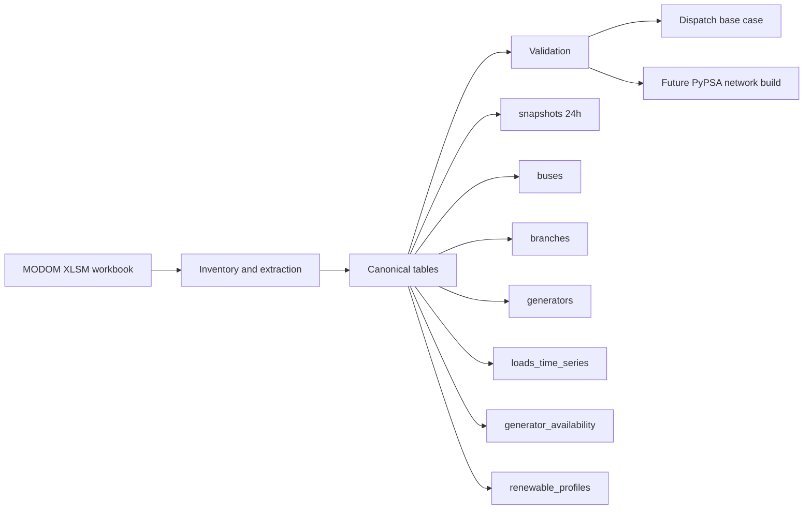

# modom-pypsa

Reproducible pipeline for transforming daily `MODOM` operational cases into canonical power-system tables and PyPSA-ready workflows for Dominican SENI studies.

## Why this project exists

`MODOM` daily cases contain valuable operational information, but the workbook structure is not a stable public interface for reproducible analysis. This project creates a clean engineering workflow that:

- reads workbook data without Excel or VBA execution
- reconciles inconsistent identifiers across sheets
- builds canonical tables with traceability
- validates structural consistency before running analysis
- prepares a path toward PyPSA-based dispatch and network studies

## Current status

The project is already beyond scaffold stage.

Implemented blocks:

- workbook inventory
- canonical snapshots
- buses
- branches
- generators
- load time series
- generator availability
- renewable profiles
- first `copperplate` base dispatch
- automated tests for the implemented pipeline

Current v1 modeling decision:

- the canonical time axis is `24h`
- the `48`-period operational horizon is preserved as a secondary source layer
- the first public workflow prioritizes consistency and reproducibility over premature temporal detail

## Workflow at a glance



## Repository structure

```text
modom-pypsa/
├── configs/              # project configuration notes
├── data/
│   ├── raw/              # source inputs, intentionally not versioned
│   └── processed/        # generated canonical outputs, intentionally not versioned
├── docs/                 # technical design and mapping notes
├── scripts/              # CLI entrypoints for each pipeline step
├── src/modom_pypsa/      # core library code
├── tests/                # regression tests and workbook fixtures
├── .gitignore
├── pyproject.toml
└── README.md
```

## Canonical pipeline

The intended project sequence is:

1. `inventory`
   - inspect workbook structure
   - detect focus sheets
   - export reproducible previews
2. `transform`
   - normalize sheet-specific data into canonical tables
   - reconcile identifiers across workbook layers
3. `validate`
   - check structural consistency
   - surface unresolved modeling gaps explicitly
4. `dispatch`
   - run a first reproducible base dispatch
5. `build_pypsa`
   - move toward network-constrained studies once inputs are mature enough

## Canonical tables

Current core tables:

- `snapshots`
- `buses`
- `branches`
- `generators`
- `loads_time_series`
- `generator_availability`
- `renewable_profiles`

These tables are documented in [`docs/`](./docs) and exported under `data/processed/` during execution.

## Time-axis decision

One of the key findings from the real `V449` case is that `MODOM` mixes at least two time axes:

- `24` hourly blocks in `PDemanda`
- `24` hourly blocks in `Despacho Potencia`
- `48` periods in `e_sets`
- `48` periods in `S_FLUJO`, `VOLTAJE`, `Reporte de Disponibilidad`, and `Pronostico Renovable`

For the first public workflow, the project adopts:

- `24h` as the canonical axis for `snapshots`
- explicit preservation of the `48`-period horizon as a source-side operational layer

This avoids hiding a weak or implicit `48 -> 24` translation inside the model.

## What v1 already validates

The current v1 can:

- build a `24h` canonical snapshot set
- align load time series to that axis
- derive hourly generator availability and renewable profiles for the first public workflow
- validate dispatch inputs structurally
- run a first base dispatch without unserved load in the current `copperplate` setup

## Known limitations

This repository is not yet a full network-constrained PyPSA study engine.

Important open issues remain:

- some generators still have `pmax_mw < pmin_mw`
- some generators still lack `cvp`
- branch impedance and unit interpretation still need confirmation before serious OPF work
- the current `48 -> 24` rule is a v1 engineering choice, not a final authoritative market translation

## Quick start

### 1. Use Python 3.11+

The project is currently lightweight and intentionally conservative in dependencies.

### 2. Inventory a workbook

```bash
python3 scripts/inventory_modom_workbook.py \
  --xlsm /path/to/MODOM_DIARIO_case.xlsm
```

### 3. Build canonical tables

```bash
python3 scripts/build_snapshots.py --xlsm /path/to/MODOM_DIARIO_case.xlsm
python3 scripts/build_buses.py --xlsm /path/to/MODOM_DIARIO_case.xlsm
python3 scripts/build_branches.py --xlsm /path/to/MODOM_DIARIO_case.xlsm
python3 scripts/build_generators.py --xlsm /path/to/MODOM_DIARIO_case.xlsm
python3 scripts/build_loads_time_series.py --xlsm /path/to/MODOM_DIARIO_case.xlsm
python3 scripts/build_generator_time_series.py --xlsm /path/to/MODOM_DIARIO_case.xlsm
```

### 4. Validate and run the first dispatch

```bash
python3 scripts/validate_dispatch_inputs.py
python3 scripts/run_dispatch_basecase.py
```

## Testing

The repository includes unit-style regression tests built around synthetic workbook fixtures.

Typical local test run:

```bash
pytest -q
```

If `pytest` is not installed yet, install it in your local environment before running the full suite.

## Public repo posture

This repository is intended to be safe for public version control, with the following rules:

- do not commit raw proprietary `MODOM` workbooks
- do not commit private operational datasets
- do not commit credentials, tokens, or private configuration secrets
- keep large generated outputs outside Git unless they are intentionally curated examples

The current `.gitignore` already excludes `data/raw/` and `data/processed/` outputs by default.

## Roadmap

Near-term priorities:

1. clean `pmax/pmin` inconsistencies
2. fill or infer missing generator cost data
3. confirm branch impedance interpretation
4. move from `copperplate` dispatch to network-aware PyPSA build
5. define a rigorous and documented bridge between `24h` and `48` operational views

## Documentation

See [`docs/`](./docs) for technical details on:

- workbook inventory
- canonical schema
- snapshots
- buses
- branches
- generators
- load time series
- generator time series
- first real MODOM mapping assumptions

## Disclaimer

This is an engineering workflow under active development.

Results should be treated as reproducible analytical outputs, not as final operational, regulatory, or market conclusions until the remaining modeling gaps are closed and validated.
