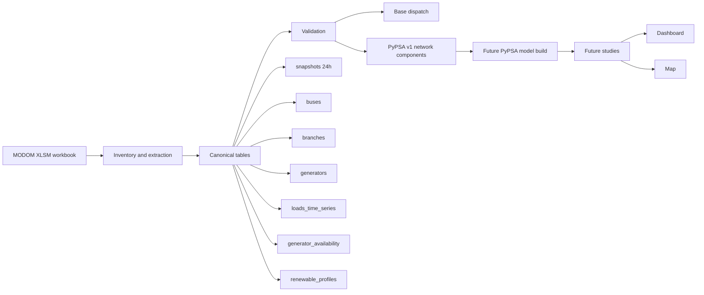

# modom-pypsa

Reproducible workflow for transforming daily `MODOM` cases into canonical power-system tables, PyPSA-ready network inputs, and future study outputs such as dashboards and geospatial result maps for Dominican SENI analysis.

## Project objective

This repository exists to turn an operational `MODOM` workbook into a traceable engineering pipeline that can later support:

- reproducible PyPSA model building
- base dispatch replication
- network-constrained studies
- dashboard-style study summaries
- map-based visualization of buses, branches, generators, and study results

The design principle is strict:

- `MODOM` workbook is the source
- canonical tables are the stable interface
- PyPSA, dashboards, and maps consume the canonical layer, not the raw workbook

## What the project already does

Implemented and working blocks:

- workbook inventory from `.xlsm` without Excel or VBA execution
- canonical `snapshots`
- canonical `buses`
- canonical `branches`
- canonical `generators`
- canonical `loads_time_series`
- canonical `generator_availability`
- canonical `renewable_profiles`
- first `copperplate` dispatch
- first `PyPSA v1` export of `lines` and `transformers`
- regression tests based on synthetic workbook fixtures

Current engineering status:

- canonical time axis for `v1`: `24h`
- `48`-period operational horizon preserved as a secondary source layer
- network topology already structured
- branch semantics partially interpreted
- bus nominal voltage inference already available for a large subset of the network

## End goal

The intended end state is not just a script collection. The intended end state is a study workflow:

1. ingest a `MODOM` daily case
2. build canonical tables
3. validate structural and electrical consistency
4. build a PyPSA model
5. run studies
6. export results to tables
7. present results in:
   - a dashboard
   - a network map
   - reproducible technical summaries

## Workflow at a glance



## Current repository structure

```text
modom-pypsa/
├── configs/                         # project configuration notes
├── data/
│   ├── raw/                         # reference MODOM source inputs tracked in this repo
│   └── processed/                   # generated canonical outputs tracked in this repo
├── docs/                            # technical design, mapping, and validation notes
├── results/
│   └── dispatch_basecase/           # curated tracked example outputs
├── scripts/                         # CLI entrypoints for each pipeline step
├── src/modom_pypsa/                 # core library code
├── tests/                           # regression tests and synthetic fixtures
├── .gitignore
├── pyproject.toml
└── README.md
```

## Canonical pipeline

The current intended execution order is:

1. `inventory`
   - inspect workbook structure
   - export stable previews
   - identify relevant source sheets
2. `transform`
   - build canonical tables from source sheets
   - reconcile identifiers and topology
3. `validate`
   - check structural consistency
   - expose unresolved modeling gaps
4. `dispatch`
   - run a first reproducible `copperplate` base dispatch
5. `build_pypsa`
   - export structured network components
   - later assemble a full PyPSA network
6. `visualize`
   - future dashboard and map layers built from canonical data and study outputs

## Canonical tables already implemented

Current core tables:

- `snapshots`
- `buses`
- `branches`
- `generators`
- `loads_time_series`
- `generator_availability`
- `renewable_profiles`

Current PyPSA-facing intermediate export:

- `lines_v1`
- `transformers_v1`
- `excluded_branches_v1`

These are generated under `data/processed/` and documented in [`docs/`](./docs).

## Key modeling decisions already fixed

### 1. Time-axis decision

Real `V449` evidence shows that `MODOM` mixes two temporal layers:

- `24` hourly blocks in `PDemanda`
- `24` hourly blocks in `Despacho Potencia`
- `48` periods in `e_sets`
- `48` periods in `S_FLUJO`, `VOLTAJE`, `Reporte de Disponibilidad`, and `Pronostico Renovable`

Current `v1` decision:

- canonical axis = `24h`
- `48`-period horizon remains preserved as source-side operational information

This is an explicit engineering choice for reproducibility. It is not yet a final authoritative interpretation of market or operational semantics.

### 2. Generator cost handling

The workflow already distinguishes:

- raw `cvp`
- effective inferred `cvp`
- audited cases still unresolved

Important finding:

- `technology_group = 4` in `MODOM` is not treated as automatically renewable
- cost-zero heuristics are only allowed when the unit name clearly indicates a variable renewable technology

### 3. Branch semantics handling

The workflow already distinguishes:

- normal series branches
- transformer-like branches with tap-like values
- auxiliary `TAP` links
- excluded v1 cases

`closure_flag` is no longer treated as a simple binary switch everywhere.

### 4. Bus nominal voltage handling

The workflow already infers `v_nom_kv` conservatively using:

- explicit voltage in bus names
- suffix heuristics where evidence is strong
- limited topology consensus where safe

## What is already validated in the real case

The current real-case workflow can already validate:

- canonical `24h` snapshot set
- bus inventory and reconciliation
- branch topology
- generator inventory and availability
- first bus nominal voltage layer
- first PyPSA-oriented branch component split
- first dispatch input consistency

Current validated real-case indicators include:

- no missing bus references in generators
- no effective `pmax < pmin`
- branch topology available
- first `lines_v1` and `transformers_v1` already exported

## Latest real-case status

As of the current repository state:

- buses: `717`
- buses with `v_nom_kv`: `599`
- buses without `v_nom_kv`: `118`
- branches: `846`
- branches included in `PyPSA v1`: `753`
- branches excluded in `PyPSA v1`: `93`
- `lines_v1`: `592`
- `transformers_v1`: `161`
- transformers with `tap_ratio_hint`: `6`

Current branch voltage audit:

- `lines_v1`
  - `same_voltage_ok = 577`
  - `line_voltage_mismatch = 9`
  - `missing_bus_v_nom = 6`
- `transformers_v1`
  - `different_voltage_ok = 45`
  - `same_voltage_transformer_suspect = 5`
  - `missing_bus_v_nom = 111`

Current base dispatch result:

- snapshot: `h_01`
- total load: `3288.904 MW`
- dispatched total: `3288.904 MW`
- unserved load: `0 MW`
- spare available capacity: `1706.115 MW`

## What this repository is for in local continuation

If you pull this repository locally, it already contains:

- the codebase
- the transformation logic
- the validation logic
- the public documentation
- the test suite
- a tracked example of base dispatch outputs in `results/dispatch_basecase/`

This means you can continue local development of:

- canonical data model improvements
- PyPSA model build scripts
- dashboard backends and frontends
- map layers for study visualization
- result post-processing
- additional tests and validation workflows

## Repository data mode

At the current repository stage, the project is prepared so local continuation
after `git pull` is practical.

This repository now carries:

- the reference `MODOM` workbook under `data/raw/`
- the generated canonical outputs under `data/processed/`
- tracked base dispatch outputs under `results/dispatch_basecase/`
- the scripts, code, tests, and documentation needed to continue development

That means a local clone or pull can start from a materially complete working
state instead of an empty data directory.

## Can you continue locally?

Yes, **it is possible**, and the repository is now structured to make that much
easier.

After pulling the repository locally, you already receive:

- the current codebase
- the reference workbook stored in `data/raw/`
- the current processed artifacts stored in `data/processed/`
- tracked dispatch example outputs

You can either:

- continue directly from the tracked artifacts
- or rebuild everything locally from the tracked workbook

## Recommended local continuation flow

After pulling the repository locally:

### 1. Create a Python environment

```bash
python3 -m venv .venv
source .venv/bin/activate
pip install -U pip pytest
```

If later you add PyPSA, dashboards, maps, and geospatial tooling, install those explicitly in the same local environment.

### 2. Use the tracked workbook or replace it with your own local case

Current repository mode already includes a reference workbook in `data/raw/`.

If later you want to run a different case, replace or add the corresponding
`.xlsm` locally and rebuild the pipeline.

### 3. Rebuild the current pipeline

```bash
python3 scripts/inventory_modom_workbook.py --xlsm data/raw/MODOM_DIARIO_dd-mm-yyyy_V449.xlsm
python3 scripts/build_snapshots.py --xlsm data/raw/MODOM_DIARIO_dd-mm-yyyy_V449.xlsm
python3 scripts/build_buses.py --xlsm data/raw/MODOM_DIARIO_dd-mm-yyyy_V449.xlsm
python3 scripts/build_branches.py --xlsm data/raw/MODOM_DIARIO_dd-mm-yyyy_V449.xlsm
python3 scripts/build_generators.py --xlsm data/raw/MODOM_DIARIO_dd-mm-yyyy_V449.xlsm
python3 scripts/build_loads_time_series.py --xlsm data/raw/MODOM_DIARIO_dd-mm-yyyy_V449.xlsm
python3 scripts/build_generator_time_series.py --xlsm data/raw/MODOM_DIARIO_dd-mm-yyyy_V449.xlsm
python3 scripts/build_pypsa_branch_components.py
python3 scripts/validate_dispatch_inputs.py
python3 scripts/run_dispatch_basecase.py
```

### 4. Run tests locally

```bash
pytest -q
```

## How this connects to future dashboards and maps

The canonical layer is already structured in the right direction for local visualization work.

Planned usage:

- `buses`
  - nodes on a network map
  - nominal voltage coloring
  - bus-level aggregation of study results
- `lines_v1` and `transformers_v1`
  - network edges
  - branch status summaries
  - future congestion or loading displays
- `generators`
  - generator markers
  - technology filters
  - marginal-cost and dispatch views
- `loads_time_series`
  - demand charts
  - spatial demand summaries
- study results
  - dashboard KPI cards
  - time-series plots
  - thematic map overlays

This means the repository is already suitable as the backend data-model foundation for:

- a Streamlit dashboard
- a Plotly/Dash dashboard
- a Leaflet/Folium/Kepler/Deck.gl map workflow
- custom PyPSA study notebooks

## What is still missing before a serious PyPSA study workflow

This is not yet a full network-constrained PyPSA study engine.

Main open issues:

1. one generator still lacks effective cost treatment
2. branch impedance and unit interpretation are still not final
3. `118` buses still lack `v_nom_kv`
4. `9` line voltage mismatches still need classification
5. `111` transformers still lack complete voltage audit because one or both buses remain unresolved
6. no final `network = pypsa.Network()` builder exists yet
7. no dashboard or map module exists yet inside the repository

## Testing

The repository includes regression-style tests based on synthetic workbook fixtures.

Typical local test run:

```bash
pytest -q
```

If `pytest` is not installed in the environment, install it explicitly before running the full suite.

## Public repo posture

This repository is currently being used in a continuity-first mode.

That means:

- the reference workbook is tracked
- processed artifacts are tracked
- local continuation after pull is prioritized

Even in this mode, never commit:

- credentials
- tokens
- private configuration secrets
- unrelated private datasets

## Roadmap

Recommended near-term local continuation order:

1. classify the `9` `line_voltage_mismatch` cases
2. resolve more pending `v_nom_kv` values
3. finish branch electrical interpretation
4. build the first actual PyPSA network constructor
5. export study-ready result tables
6. add dashboard layer
7. add map layer

## Documentation

See [`docs/`](./docs) for technical details on:

- workbook inventory
- canonical schema
- snapshots
- buses
- branches
- generators
- load time series
- generator time series
- PyPSA branch component export
- first real MODOM mapping assumptions

## Bottom line

Yes, you can continue locally after pulling the project.

At the current repository state, Git already gives you:

- this repository
- the tracked reference `MODOM` workbook
- the tracked processed artifacts
- the code and tests

You still need a local Python environment, but the data continuity problem is
now largely solved inside the repository.

With that setup, the current repository already gives you a reproducible base to keep building toward:

- PyPSA models
- study dashboards
- result maps

## Disclaimer

This repository is an engineering workflow under active development.

Outputs should be treated as reproducible analytical artifacts, not as final operational, regulatory, or market conclusions until the remaining modeling gaps are closed and validated.
