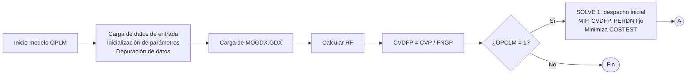
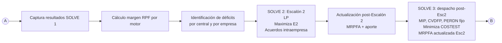
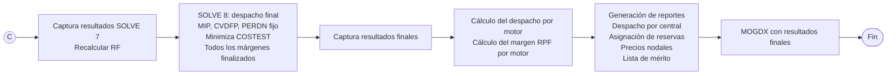
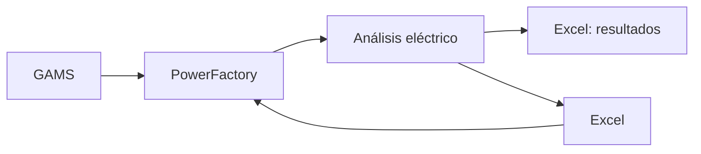

# Programación de corto plazo

## Criterio de transcripción

Esta es una transcripción estructurada y legible por agentes de software del PDF **Programación de la operación - Programación de corto plazo, V16**.

- Las ecuaciones fueron convertidas a LaTeX.
- Los diagramas de proceso fueron convertidos a listas y diagramas Mermaid.
- Se omitieron únicamente elementos decorativos repetidos, como logotipos, fondos y pies de página.
- Las referencias de página indican la página física del PDF, no necesariamente el número impreso en la diapositiva.
- No se corrigieron silenciosamente posibles inconsistencias del documento fuente. Cuando son relevantes, se señalan como **Nota de transcripción**.
- Los símbolos se conservan tal como aparecen, aunque la presentación no incluya una definición explícita para todos ellos.

---

# 1. Portada y contenido

<!-- source-pages: 1-2 -->

## 1.1 Datos del documento

- **Organización:** Organismo Coordinador del Sistema Eléctrico Nacional Interconectado de la República Dominicana, Inc.
- **Gerencia:** Gerencia de Operaciones.
- **Título:** Programación de corto plazo.
- **Versión:** V16.
- **Elaborado/presentado por:** Programación de la operación; encargado y analistas de programación de la operación.
- **Aprobado por:** Iván Veras, Gerente de Operaciones.
- **Fecha:** 2025-10-07.

## 1.2 Contenido

1. Procesos del Área de Programación de la Operación.
2. Programación de corto plazo.
3. Descripción del proceso de la programación de la operación.
4. Criterios de la programación de la operación.
5. Herramientas de toma de decisión.
6. Salidas del proceso.

---

# 2. Procesos del Área de Programación de la Operación

<!-- source-pages: 3-4 -->

## 2.1 Procesos y productos

| Proceso | Producto o resultado |
|---|---|
| Verificación de costos variables | Costos variables de producción de centrales térmicas. |
| VEROPE | Verificación de Restricciones Operativas de Centrales Térmicas. Tabla con parámetros certificados, establecidos en el numeral 1 del artículo 35 de la Resolución SIE-061-2015-MEM. |
| Programación de corto plazo semanal | Programa Semanal de Operaciones. |
| Programación de corto plazo diaria | Programa Diario de Operaciones. |

---

# 3. Programación de corto plazo

<!-- source-pages: 5-24 -->

## 3.1 Finalidad general

La programación de corto plazo utiliza información técnica y operativa para:

1. **Planificar la operación:**
   - Una semana antes.
   - Un día antes.
2. **Servir de guía para la operación del SENI:**
   - Despacho de generación.
   - Asignación de reservas.
   - Gestión de restricciones.
   - Consignas de tensión.
3. **Abastecer la demanda:**
   - Despacho económico.
   - Seguridad.
   - Calidad.

## 3.2 Criterios de programación del SENI

La programación se desarrolla conforme a:

- Leyes.
- Reglamentos.
- Resoluciones.
- Procedimientos.

Los criterios se agrupan en:

- Criterios económicos.
- Criterios de seguridad.
- Criterios de calidad.

## 3.3 Esquema general del proceso

### Entradas

- Disponibilidad de generación.
- Pronóstico de energía renovable.
- Demanda activa y reactiva, $P$ y $Q$.
- Mantenimientos de red.
- Costos variables de producción.
- Pruebas de centrales.
- Características técnicas de centrales.
- Configuración del sistema de transmisión.

### Análisis y toma de decisiones

- Optimización del despacho de centrales.
- Realización de análisis eléctrico.

### Salidas

- Programación de corto plazo.


## 3.4 Marco de tiempo de la programación semanal

**Referencia:** artículo 197 del RALGE.

### Semana anterior a la operación

| Responsable | Hito | Plazo |
|---|---|---|
| Agentes | Remisión de informaciones que deben tomarse en cuenta | Miércoles, 12:00 p. m. |
| OC | Publicación del programa propuesto | Jueves, 12:00 p. m. |
| Agentes | Remisión de observaciones al programa propuesto, vía Help Desk | Jueves, 6:00 p. m. |
| OC | Publicación del programa definitivo | Viernes, 12:00 p. m. |

### Semana de la operación

- Se realizan los programas diarios con las actualizaciones remitidas por los agentes.
- Si un agente no está conforme con las decisiones del OC, puede presentar su discrepancia al Consejo de Coordinación del OC, a más tardar a las 6:00 p. m. del día laborable subsiguiente. El Consejo analiza la discrepancia y adopta las resoluciones correspondientes.

## 3.5 Marco de tiempo de la programación diaria

**Referencia:** artículo 208 del RALGE.

### Día anterior a la operación

| Responsable | Hito | Plazo |
|---|---|---|
| Agentes | Remisión de informaciones que deben tomarse en cuenta | 10:00 a. m. |
| OC | Publicación del programa propuesto | 2:00 p. m. |
| Agentes | Remisión de observaciones al programa propuesto, vía Help Desk | 4:00 p. m. |
| OC | Publicación del programa definitivo | 6:00 p. m. |

### Día de la operación

- Se realizan redespachos con las actualizaciones remitidas por los agentes.
- Si un agente no está conforme con la decisión del OC, puede presentar su discrepancia ante el Consejo de Coordinación del OC, a más tardar a las 6:00 p. m. del día subsiguiente.

## 3.6 Programación diaria para domingo, lunes o feriado

### Viernes o día indicado en el cronograma de ajuste

| Responsable | Hito | Plazo indicado en la presentación |
|---|---|---|
| Agentes | Remisión de informaciones | 11:00 a. m. |
| OC | Publicación del programa propuesto | `XX:00 p. m.` |
| Agentes | Remisión de observaciones | Dos horas después del PDP |
| OC | Publicación del programa definitivo | `XX:00 p. m.` |

Durante el día de la operación se realizan redespachos con las actualizaciones de los agentes. El mecanismo de discrepancia es el mismo indicado para la programación diaria ordinaria.

## 3.7 Declaración de demanda

- Cada agente del Mercado Eléctrico Mayorista, MEM, declara la demanda de su punto de retiro.
- Se declara el pronóstico horario de energía activa y reactiva en MWh y MVARh.
- La información se declara para la programación semanal y se actualiza para la programación diaria.

## 3.8 Declaración de disponibilidad

### Generadores convencionales

- Declaran su disponibilidad horaria en MW.
- Declaran la causa de la indisponibilidad.

### Parques renovables, ERV

- Declaran capacidad disponible en MW.
- Declaran su pronóstico de producción de energía en MWh.
- Declaran la causa de la indisponibilidad.

### Sistemas de almacenamiento, SAEB

- Declaran la potencia disponible de regulación en MW.
- Declaran la causa de la indisponibilidad.

## 3.9 Mecanismo de declaraciones

Las declaraciones se transmiten mediante una planilla en formato CSV a través de REGIO, Registro de Eventos Operativos, y son incorporadas a la base de datos del OC.


## 3.10 Servicio de pronóstico centralizado de ERV

- En la programación de corto plazo se utiliza un pronóstico centralizado de producción de generación renovable variable, ERV.
- El pronóstico es elaborado y provisto por el suplidor externo **energy & meteo systems**.

### Justificación

- La ERV representa aproximadamente el 28 % de la capacidad instalada del sistema.
- Puede representar más del 40 % de la generación durante períodos de alta penetración.
- Pronosticar la ERV permite planificar y operar el sistema de forma segura, eficiente y al menor costo, considerando su variabilidad y su impacto sobre el sistema.

### Datos suministrados al servicio

**Centrales ERV:**

- Disponibilidad y pronóstico propio.
- Un archivo diario con resolución horaria.

**Mediciones registradas en SCADA:**

- Un archivo cada 15 minutos.
- 96 archivos diarios.

**Proveedor del servicio:**

- Dispone de una hora para procesar el pronóstico.
- Produce un pronóstico con resolución de 15 minutos para cada central ERV.

### Horizontes empleados

| Uso | Horizonte |
|---|---|
| Programación semanal, semana anterior | Pronóstico de 7 días |
| Programación diaria, día anterior | Pronóstico de 48 horas |
| Redespachos intradía | Cada hora, con 12 horas de pronóstico |

## 3.11 Solicitudes de pruebas de generación

- El agente del MEM remite la solicitud mediante REGIO y Help Desk 2.0.
- El OC realiza una etapa de análisis, verificación y aprobación.
- Cuando la prueba supera 72 horas, se involucra a la Superintendencia de Electricidad.
- Referencia: **OC 58-2017, Procedimiento para la gestión de los permisos de operación en el SENI, capítulo 4**.

## 3.12 Topología de la red de transmisión

- El Programa Diario de Operación debe incluir la configuración del Sistema de Transmisión.
- La Empresa de Transmisión y las Empresas de Generación deben entregar al OC el estado y las características topológicas del Sistema de Transmisión.
- Referencia: RALGE 125-01, artículo 180.
- La información se utiliza en PowerFactory y se intercambia con el Centro de Control de Energía, CCE.

## 3.13 Mantenimientos de la red de transmisión

Se consideran:

- Mantenimientos aprobados en el programa de mantenimiento de redes.
- Mantenimientos fuera del programa que hayan sido aprobados.
- Si se cancela un mantenimiento previamente aprobado, el agente solicitante debe notificarlo al OC.

---

# 4. Criterios de la programación de la operación

<!-- source-pages: 25-40 -->

## 4.1 Criterios económicos

### Marco regulatorio

El artículo 178 del RALGE 125-01 establece que la programación de corto plazo debe garantizar una operación confiable y de mínimo costo económico, minimizando los costos de operación del conjunto de instalaciones de generación y transmisión, independientemente de la propiedad de las instalaciones y de los contratos de suministro.

### Orden de despacho

1. Prioridad a las centrales renovables y a las hidroeléctricas de pasada.
   - Referencias: artículo 112 de la LGE 125-01; artículos 119, 200 y 210 del RALGE 125-01.
2. Despacho de hidroeléctricas con embalse en las horas de mayor demanda.
   - Referencias: artículos 201 y 211 del RALGE 125-01.
3. Despacho de termoeléctricas de menor a mayor CVD hasta completar la demanda, minimizando la energía no suministrada y respetando las restricciones operativas de las unidades y del Sistema de Transmisión.
   - Referencias: artículos 202 y 212 del RALGE 125-01.

### Composición conceptual de la curva de demanda

- En la base: hidroeléctricas de pasada, eólicas, biomasa y solares.
- En la zona intermedia: centrales termoeléctricas, ordenadas por lista de mérito o CVD y sujetas a sus restricciones operativas.
- En las horas de mayor demanda: hidroeléctricas de embalse.

## 4.2 Optimización del despacho

El MODOM combina:

- Función objetivo.
- Variables de decisión y parámetros.
- Restricciones.

El resultado es la optimización del despacho.

## 4.3 Criterios de seguridad y calidad

### Criterio N-1

Marco normativo indicado:

- Límite máximo ante contingencia N-1.
- Artículo 156 del RALGE 125-01.
- Resolución SIE-039-2013-MEM.

### Acciones para gestionar sobrecargas y contingencias N-1

Orden mostrado en la presentación:

1. Mejorar las condiciones de voltaje en subestaciones.
2. Abrir o cerrar interruptores de línea.
3. Modificar el despacho de potencia de una central.
4. Limitar el despacho de centrales.
5. Recomendar deslastres de carga.

## 4.4 Reserva de regulación de frecuencia

Los artículos 203 y 205 del RALGE indican que debe existir reserva operativa para regular frecuencia:

- Regulación primaria: 3 % a 5 %.
- Regulación secundaria: 3 % a 5 %.

### Rango operativo ilustrado

Para un generador se distinguen:

- Potencia máxima declarada.
- Generación programada máxima con RPF.
- Márgenes de RSF y RPF por encima del despacho.
- Nivel de Operación Sostenible, NOS.
- Generación programada mínima con RPF.
- Márgenes de RSF y RPF por debajo del despacho.
- Potencia mínima.

## 4.5 Asignación de RPF

Secuencia de acciones:

1. Asignar al menos el 3 % de la disponibilidad de cada central habilitada programada.
2. Si una central no cubre su margen obligatorio, utilizar acuerdos de cobertura dentro de la misma empresa.
3. Si persiste la insuficiencia, utilizar acuerdos de cobertura entre empresas.
4. Si persiste la insuficiencia, asignar mediante la lista de mérito del factor $A$.
5. Si aún persiste, aplicar despacho forzado por RPF.

## 4.6 Asignación de RSF

**Referencia:** Resolución SIE-098-2019-MEM.

Para asignar la Regulación Secundaria de Frecuencia en la programación del despacho, se priorizan las centrales habilitadas para recibir comandos desde el Control Automático de Generación, AGC, del Centro de Control de Energía, CCE.

## 4.7 Limitación de generación por seguridad

**Referencia:** Resolución SIE-118-2024-MEM.

Secuencia mostrada:

1. Reducir la generación de centrales termoeléctricas conforme a los artículos 202 y 212 del RALGE.
2. Si se requiere una limitación adicional, desplazar el despacho de centrales hidroeléctricas de embalse a otros bloques horarios.
3. Si aún se requieren limitaciones, reducir las hidroeléctricas de pasada hasta su mínimo técnico.
4. Si se requiere una reducción mayor para mantener la seguridad, limitar las centrales del régimen especial.

## 4.8 Calidad de tensión

El artículo 149 del RALGE establece que los niveles de tensión en las subestaciones deben mantenerse dentro de un rango de $\pm 5\%$ alrededor de la tensión nominal.

| Tensión nominal | Límite inferior, -5 % | Límite superior, +5 % |
|---:|---:|---:|
| 345 kV | 327.75 kV | 365.25 kV |
| 138 kV | 131.1 kV | 144.9 kV |
| 69 kV | 65.55 kV | 72.45 kV |

## 4.9 Acciones para controlar tensión

Condición indicada: la generación reactiva debe mantenerse en un valor menor o igual al 90 % de su límite, conforme al artículo 151 del RALGE 125-01.

Secuencia de acciones:

1. Identificar niveles de voltaje adversos, mayores o menores que el margen del 5 %.
2. Ajustar la consigna de tensión de los nodos piloto.
3. Ajustar la tensión de generadores no asociados a nodos piloto.
4. Abrir o cerrar bancos de capacitores.
5. Cambiar la posición de taps de autotransformadores.
6. Realizar cambios topológicos.
7. Aplicar despacho forzado por tensión.
8. Deslastrar carga.

---

# 5. MODOM

<!-- source-pages: 41-46 -->

## 5.1 Definición

El **Modelo de Operación Dominicano, MODOM**, es un modelo de optimización del despacho de corto plazo de generación y red. Determina las variables de funcionamiento que definen la operación del SENI y minimiza los costos variables de operación para un período temporal definido.

El modelo determina:

- Decisiones binarias de asignación de grupos de generación.
- Producción de los grupos.
- Flujos de potencia a través de la red.

## 5.2 Tecnologías de optimización

- Desarrollado en **GAMS**, General Algebraic Modeling System.
- Utiliza **CPLEX** para:
  - LP, Programación Lineal.
  - MIP, Programación Lineal Entera Mixta.
- Incorpora **DICOPT** para MINLP, Programación No Lineal Entera Mixta.
- Incorpora **CONOPT** para NLP, Programación No Lineal.

La combinación permite incorporar nuevas consideraciones y adaptar el modelo a las necesidades del sistema.

## 5.3 Resumen estadístico

| Elemento | Cantidad aproximada |
|---|---:|
| Generadores totales | 130+ |
| Unidades individuales | 180+ |
| Embalses | 17 |
| Nodos de red | 650+ |
| Líneas y transformadores | 800+ |
| Nodos con demanda | 280+ |
| Períodos de una hora | 48-168 |
| Empresas generadoras | 40+ |
| Regiones | 3: Sur, Norte y Este |

## 5.4 Arquitectura de archivos

### Archivos de entrada

- `e_sets`
- `e_opcn`
- `e_dated`
- `e_datgen`
- `e_datgpf`
- `e_datmnx`
- `e_datdem`
- `e_datgate`
- `e_dathidro`
- `e_datmoded`

### Cadena principal

```text
Archivos de entrada
    -> MODOM_NV_73PS - NCV
    -> MOGDX
    -> MODOM_NV_73PS - OPLM
    -> REPORTES
    -> Archivos de salida
```

### Archivos de salida mostrados

- `S_RSF`
- `S_RPF`
- `S_AGC`
- `S_PNSU`
- `S_RFRIA`
- `S_FLUJO`
- `S_ACRPF`
- `S_PENSB`
- `S_RTERM`
- `S_INERCIA`
- `VARSTADO`
- `S_FWGATE`
- `S_RESUMEN`
- `ROPERATIVA`
- `S_NEMBALSE`
- `S_DESPACHOM`
- `S_CURTAILMENT`
- `DESPACHO_MOTOR`
- `S_LMERITO`
- `S_FNODO`

## 5.5 Estructura matemática

- **Conjuntos:** elementos físicos y temporales sobre los cuales opera el modelo.
- **Parámetros:** información técnica y económica conocida que alimenta el modelo.
- **Variables:** incógnitas o decisiones que el modelo debe optimizar.
- **Función objetivo:** criterio que define el mejor despacho y minimiza el costo total de operación.
- **Restricciones:** leyes físicas y límites operativos que deben cumplirse.

---

# 6. Función objetivo

<!-- source-pages: 47-49 -->

El objetivo es **minimizar el costo total de generación y operación**, manteniendo la seguridad, confiabilidad y calidad del suministro. El modelo equilibra objetivos en conflicto mediante costos y penalizaciones jerarquizados.

## 6.1 Formulación matemática

$$
\begin{aligned}
Z ={}&
\sum_{n\in N}\sum_{g\in G_{\text{térmico}}}
CVP_g^{ef}\,P_{n,g}
+
CENS\sum_{n\in N}PNS_n^{\text{total}}
+
\sum_{n\in N}\sum_{e\in\mathcal{E}}
CVERR\,VERT_{n,e}
\\[2mm]
&+
CVRRF\sum_{n\in N}\sum_{g\in G_{RSF}}\xi_{n,g}^{RSF}
+
CVRRF\sum_{n\in N}\sum_{g\in G_{AGC}}\xi_{n,g}^{AGC}
\\[2mm]
&+
\sum_{n\in N}\sum_{g\in G_{\text{térmico}}}
C_g^{ARR}\,u_{n,g}^{ARR}
+
\sum_{n\in N}\sum_{g\in G_{\text{térmico}}}
C_g^{PAR}\,u_{n,g}^{PAR}.
\end{aligned}
$$

Los términos están identificados en la presentación como:

- Costo de generación térmica.
- Costo de déficit.
- Costo de vertimientos.
- Penalizaciones por reserva.
- Costos de arranque y parada.

## 6.2 Costo variable efectivo

$$
CVP_g^{ef}=
\begin{cases}
CVP_g, & \text{versión NCV},\\[2mm]
\dfrac{CVP_g}{FNPROM_g}, & \text{versión OPLM}.
\end{cases}
$$

---

# 7. Restricciones matemáticas

<!-- source-pages: 50-78 -->

## 7.1 Compromiso de unidades

Estas restricciones controlan las transiciones de estado permitidas para las unidades térmicas, de forma que las secuencias operativas sean físicamente posibles.

### 7.1.1 Estados mutuamente excluyentes

$$
v_{n,g}^{ACC}
+
 u_{n,g}^{ARR}\,\mathbf{1}_{TARR_g\ge 1}
+
 u_{n,g}^{PAR}\,\mathbf{1}_{TPAR_g\ge 1}
+
 v_{n,g}^{RFA}
=1,
$$

$$
\forall n\in N,\quad
\forall g\in G_{\text{activo}}\setminus G_{\text{mantenimiento}}.
$$

Interpretación de los estados indicada en la lámina:

- $v^{ACC}$: acoplada.
- $u^{ARR}$: arrancando.
- $u^{PAR}$: parando.
- $v^{RFA}$: reserva fría.

### 7.1.2 Transiciones de estado prohibidas

**Parada a acoplada:**

$$
u_{n-1,g}^{PAR}+v_{n,g}^{ACC}\le 1.
$$

**Parada a arranque:**

$$
u_{n-1,g}^{PAR}+u_{n,g}^{ARR}\le 1.
$$

**Arranque a reserva fría:**

$$
u_{n-1,g}^{ARR}+v_{n,g}^{RFA}\le 1.
$$

**Arranque a parada:**

$$
u_{n-1,g}^{ARR}+u_{n,g}^{PAR}\le 1.
$$

**Reserva fría a acoplada:**

$$
v_{n-1,g}^{RFA}+v_{n,g}^{ACC}\le 1.
$$

**Acoplada a reserva fría:**

$$
v_{n-1,g}^{ACC}+v_{n,g}^{RFA}\le 1.
$$

**Arranques múltiples consecutivos:**

$$
u_{n-1,g}^{ARR}+u_{n,g}^{ARR}\le 1.
$$

**Paradas múltiples consecutivas:**

$$
u_{n-1,g}^{PAR}+u_{n,g}^{PAR}\le 1.
$$

Dominio indicado:

$$
\forall n\in N,\quad \forall g\in G_{\text{transitorio}},
$$

$$
G_{\text{transitorio}}
=
\left\{g\in G_{\text{activo}}:TARR_g\ge 1\ \lor\ TPAR_g\ge 1\right\}.
$$

## 7.2 Potencias máxima y mínima variables

Estas restricciones representan la variación dinámica de los límites de generación durante los procesos de arranque y parada.

### 7.2.1 Potencia máxima variable

$$
\begin{aligned}
PG_{n,g}^{MAX} ={}&
 v_{n,g}^{ACC}\,PMX_{n,g}
+
\frac{PMN_{n,g}}{TARR_g}
\sum_{t\in\mathcal{T}_{ARR}}
\left(n^*+TARR_g-t^*\right)u_{t,g}^{ARR}
\\[1mm]
&+
\frac{PMN_{n,g}}{TPAR_g}
\sum_{t\in\mathcal{T}_{PAR}}
\left(t^*+TPAR_g-n^*\right)u_{t,g}^{PAR}.
\end{aligned}
$$

$$
\mathcal{T}_{ARR}
=
\left\{t\in N:n^*\le t^*<n^*+TARR_g\right\},
$$

$$
\mathcal{T}_{PAR}
=
\left\{t\in N:n^*-TPAR_g+1\le t^*\le n^*\right\},
$$

$$
\forall n\in N,\quad\forall g\in G_{\text{activo}}.
$$

### 7.2.2 Potencia mínima variable

$$
\begin{aligned}
PG_{n,g}^{MIN} ={}&
 v_{n,g}^{ACC}\,PMN_{n,g}
+
\frac{PMN_{n,g}}{TARR_g}
\sum_{t\in\mathcal{T}_{ARR}}
\left(n^*+TARR_g-t^*\right)u_{t,g}^{ARR}
\\[1mm]
&+
\frac{PMN_{n,g}}{TPAR_g}
\sum_{t\in\mathcal{T}_{PAR}}
\left(t^*+TPAR_g-n^*\right)u_{t,g}^{PAR}.
\end{aligned}
$$

Los conjuntos $\mathcal{T}_{ARR}$ y $\mathcal{T}_{PAR}$ y el dominio son los mismos de la formulación anterior.

**Nota de transcripción:** las expresiones de $PG^{MAX}$ y $PG^{MIN}$ aparecen con la misma estructura en el documento fuente; la diferencia explícita está en el término estable, $PMX_{n,g}$ frente a $PMN_{n,g}$.

## 7.3 Límites de generación

### 7.3.1 Límite superior

$$
P_{n,g}
\le
PG_{n,g}^{MAX}
-
MR_{n,g}^{AGC}
-
MR_{n,g}^{RSF}
-
\left(MR_{n,g}^{RPF}-SAE_{g,n}\right)v_{n,g}^{ACC},
$$

$$
\forall n\in N,\quad\forall g\in G_{\text{activo}}.
$$

### 7.3.2 Límite inferior para centrales regulares

$$
P_{n,g}
\ge
PG_{n,g}^{MIN}
+
MR_{n,g}^{AGC}
+
MR_{n,g}^{RSF}
+
HSF_{g,n}v_{n,g}^{ACC}
+
\left(MR_{n,g}^{RPF}-SAE_{g,n}\right)v_{n,g}^{ACC},
$$

$$
\forall n\in N,\quad\forall g\in G_{\text{regular}}.
$$

### 7.3.3 Límite inferior para autoproductores

$$
P_{n,g}
\ge
PFP_{g,n}
+
MR_{n,g}^{AGC}
+
MR_{n,g}^{RSF}
+
HSF_{g,n}v_{n,g}^{ACC}
+
\left(MR_{n,g}^{RPF}-SAE_{g,n}\right)v_{n,g}^{ACC},
$$

$$
\forall n\in N,\quad\forall g\in G_{\text{autoproductor}}.
$$

## 7.4 Reserva del sistema

Estas restricciones garantizan capacidad adicional para responder a desviaciones entre generación y demanda.

### 7.4.1 Requisito de RPF

$$
\sum_{g\in G_{RPF}}
\left(MR_{n,g}^{RPF}+\xi_{n,g}^{RPF}\right)
\ge
RRPF_n\sum_{g\in G_{\text{activo}}}P_{n,g},
$$

$$
\forall n\in N:RRPF_n>0.
$$

### 7.4.2 Requisito de RSF

$$
\sum_{g\in G_{RSF}}
\left(MR_{n,g}^{RSF}+HSF_{g,n}v_{n,g}^{ACC}+\xi_{n,g}^{RSF}\right)
+
\sum_{g\in G_{AGC}}MR_{n,g}^{AGC}
=
RRSF_n\sum_{g\in G_{\text{activo}}}P_{n,g},
$$

$$
\forall n\in N:RRSF_n>0.
$$

## 7.5 Límites de margen por central

### 7.5.1 Centrales regulares

$$
MR_{n,g}^{RSF}
\le
\min\left(MTSF_{g,n},\;MRSFU_g\,UND_{g,n},\;MRSF_g\right)
 v_{n,g}^{ACC}DRS_{g,n}
-
MR_{n,g}^{AGC}.
$$

### 7.5.2 Autoproductores

$$
MR_{n,g}^{RSF}
\le
\min\left(
\frac{MX_{g,n}-\left(PFP_{g,n}+2MR_{n,g}^{RPF}\right)}{2},
\;MRSF_g
\right)
DRS_{g,n}
-
MR_{n,g}^{AGC}.
$$

## 7.6 Reserva de AGC

### 7.6.1 Requisito agregado

$$
\sum_{g\in G_{AGC}}
\left(MR_{n,g}^{AGC}+\xi_{n,g}^{AGC}\right)
\ge
RRSF_n\sum_{g\in G_{\text{activo}}}P_{n,g},
$$

$$
\forall n\in N:RRSF_n>0.
$$

### 7.6.2 Límite por central

$$
MR_{n,g}^{AGC}\le AGC_{g,n},
$$

$$
\forall n\in N,\quad\forall g\in G_{AGC}.
$$

## 7.7 Rampas de generación

### 7.7.1 Rampa de subida

$$
P_{n+1,g}-P_{n,g}
\le
RS_g\,v_{n,g}^{ACCS},
$$

$$
\forall n\in N_{\text{interior}},\quad
\forall g\in G_{\text{rampa-subida}},
$$

$$
N_{\text{interior}}=\left\{n\in N:n^*>1\right\},
$$

$$
G_{\text{rampa-subida}}
=
\left\{g\in G_{\text{activo}}:RS_g>0\right\}.
$$

### 7.7.2 Rampa de bajada

$$
P_{n-1,g}-P_{n,g}
\le
RB_g\,v_{n,g}^{ACCB},
$$

$$
\forall n\in N_{\text{interior}},\quad
\forall g\in G_{\text{rampa-bajada}},
$$

$$
G_{\text{rampa-bajada}}
=
\left\{g\in G_{\text{activo}}:RB_g>0\right\}.
$$

### 7.7.3 Exclusividad de dirección de rampa

$$
v_{n,g}^{ACCS}+v_{n,g}^{ACCB}\le 1,
$$

$$
\forall n\in N_{\text{interior}},\quad
\forall g\in G_{\text{con-rampa}},
$$

$$
G_{\text{con-rampa}}
=
\left\{g\in G_{\text{activo}}:RS_g>0\ \lor\ RB_g>0\right\}.
$$

## 7.8 Tiempo mínimo de arranque

La restricción obliga a mantener el proceso de arranque sin interrupción durante su duración mínima.

$$
\sum_{t\in\mathcal{T}_{\text{ventana}}}u_{t,g}^{ARR2}
=
TARR_g\,u_{n,g}^{ARR}
+
\sum_{k=1}^{TARR_g-1}
\left(TARR_g-k\right)
\left(u_{n-k,g}^{ARR}+u_{n+k,g}^{ARR}\right).
$$

$$
\mathcal{T}_{\text{ventana}}
=
\left\{t\in N:n^*-TARR_g+1\le t^*\le n^*\right\},
$$

$$
\forall n\in N,\quad\forall g\in G_{\text{arrancable}},
$$

$$
G_{\text{arrancable}}
=
\left\{g\in G_{\text{activo}}:TARR_g\ge 1\right\}.
$$

## 7.9 Tiempo mínimo de parada

La restricción obliga a mantener el proceso de parada sin interrupción durante su duración mínima.

$$
\sum_{t\in\mathcal{T}_{\text{ventana}}}u_{t,g}^{PAR2}
=
TPAR_g\,u_{n,g}^{PAR}
+
\sum_{k=1}^{TPAR_g}
\left(TPAR_g-k\right)
\left(u_{n-k,g}^{PAR}+u_{n+k,g}^{PAR}\right).
$$

$$
\mathcal{T}_{\text{ventana}}
=
\left\{t\in N:n^*\le t^*<n^*+TPAR_g\right\},
$$

$$
\forall n\in N,\quad\forall g\in G_{\text{parable}}.
$$

El documento muestra además:

$$
G_{\text{arrancable}}
=
\left\{g\in G_{\text{activo}}:TPAR_g\ge 1\right\}.
$$

**Nota de transcripción:** la última definición aparece como $G_{\text{arrancable}}$ en la lámina, aunque el dominio inmediatamente anterior utiliza $G_{\text{parable}}$. Se conserva la inconsistencia del original.

## 7.10 Tiempo entre parada y arranque

### 7.10.1 Tiempo mínimo en reserva fría

$$
\sum_{t\in\mathcal{T}_{\min}}v_{t,g}^{RFA}
\ge
\left(TMPA_g+TPAR_g+TARR_g-1\right)u_{n,g}^{PAR}.
$$

$$
\mathcal{T}_{\min}
=
\left\{t\in N:n^*<t^*\le n^*+TMPA_g+TPAR_g+TARR_g-1\right\},
$$

$$
\forall n\in N,\quad\forall g\in G_{\text{enfriamiento}},
$$

$$
G_{\text{enfriamiento}}
=
\left\{g\in G_{\text{activo}}:TMPA_g>0\right\}.
$$

### 7.10.2 Tiempo máximo en reserva fría

$$
\sum_{t\in\mathcal{T}_{\max}}v_{t,g}^{RFA}
\le
TMXPA_g+TPAR_g+TARR_g-2.
$$

$$
\mathcal{T}_{\max}
=
\left\{t\in N:n^*<t^*\le n^*+TMXPA_g+TPAR_g+TARR_g\right\},
$$

$$
\forall n\in N,\quad\forall g\in G_{\text{rearranque}},
$$

$$
G_{\text{rearranque}}
=
\left\{g\in G_{\text{activo}}:TMXPA_g>0\right\}.
$$

## 7.11 Arranques consecutivos y número máximo de arranques

### 7.11.1 Arranques consecutivos

$$
\sum_{t\in\mathcal{T}_{\text{ventana}}}u_{t,g}^{ARR}\le 1,
$$

$$
\mathcal{T}_{\text{ventana}}
=
\left\{t\in N:n^*\le t^*<n^*+TARR_g\right\},
$$

$$
\forall n\in N,\quad\forall g\in G_{\text{arrancable}},
$$

$$
G_{\text{arrancable}}
=
\left\{g\in G_{\text{activo}}:TARR_g\ge 1\right\}.
$$

### 7.11.2 Número máximo de arranques

$$
\sum_{n\in N}u_{n,g}^{ARR}\le NAMX_g,
$$

$$
\forall g\in G_{\text{ciclable}},
$$

$$
G_{\text{ciclable}}
=
\left\{g\in G_{\text{activo}}:NAMX_g\ge 1\right\}.
$$

## 7.12 Enclavamiento de generadores

$$
ENCLAV_{g,g'}
\left(v_{n,g}^{ACC}+v_{n,g'}^{ACC}\right)
\le 1,
$$

$$
\forall(g,g')\in\mathcal{P}_{\text{enclavado}},\quad\forall n\in N,
$$

$$
\mathcal{P}_{\text{enclavado}}
=
\left\{(g,g')\in G_{\text{activo}}\times G_{\text{activo}}:ENCLAV_{g,g'}>0\right\}.
$$

## 7.13 Flujo de potencia

### 7.13.1 Ley de flujo de potencia DC

$$
F_{\ell,n}
=
\frac{S^{BASE}}{X_{\ell}}
\left(\theta_{ni,n}-\theta_{nf,n}\right),
$$

$$
\forall n\in N,\quad\forall\ell\in\mathcal{L}.
$$

### 7.13.2 Límites térmicos de líneas

$$
-FLJMAX_{\ell}
\le
F_{\ell,n}
\le
FLJMAX_{\ell},
$$

$$
\forall n\in N,\quad\forall\ell\in\mathcal{L}.
$$

### 7.13.3 Restricciones de flowgate

$$
\sum_{\ell\in\mathcal{L}_{fg}}
F_{\ell,n}\,FGATE_{\ell,fg}
\le
FLGTMAX_{fg,n}+\varepsilon,
$$

$$
\mathcal{L}_{fg}
=
\left\{\ell\in\mathcal{L}:FGATE_{\ell,fg}>0\right\},
$$

$$
\forall n\in N,\quad\forall fg\in FG.
$$

## 7.14 Pérdidas de transmisión

### 7.14.1 Modelo de pérdidas incrementales

$$
\begin{aligned}
PERD_{\ell,n}^{LINEA}\ge{}&
S^{BASE}\frac{R_{\ell}}{X_{\ell}^{2}}
\left(\Delta\theta_{\ell}^{ref}\right)^2
\\
&+
2S^{BASE}\frac{R_{\ell}}{X_{\ell}^{2}}
\Delta\theta_{\ell}^{ref}
\left[
\left(\theta_{ni,n}-\theta_{nf,n}\right)
-
\Delta\theta_{\ell}^{ref}
\right].
\end{aligned}
$$

$$
\forall n\in N,\quad\forall\ell\in\mathcal{L}_{\text{activo}},
$$

$$
\mathcal{L}_{\text{activo}}
=
\left\{\ell\in\mathcal{L}:\Delta\theta_{\ell}^{ref}>0\right\}.
$$

### 7.14.2 Distribución de pérdidas por nodo

$$
PERD_{n,nd}
=
0.5\sum_{\ell\in\mathcal{L}_{\text{saliente}}}PERD_{\ell,n}^{LINEA}
+
0.5\sum_{\ell\in\mathcal{L}_{\text{entrante}}}PERD_{\ell,n}^{LINEA},
$$

$$
\mathcal{L}_{\text{saliente}}
=
\left\{\ell\in\mathcal{L}:ni=nd\right\},
$$

$$
\mathcal{L}_{\text{entrante}}
=
\left\{\ell\in\mathcal{L}:nf=nd\right\},
$$

$$
\forall n\in N,\quad\forall nd\in\mathcal{N}.
$$

## 7.15 Balance de potencia nodal

$$
\sum_{g\in G_{nd}}P_{n,g}
+
\sum_{\ell\in\mathcal{L}:nf=nd}F_{n,\ell}
+
PNS_{n,nd}
=
D_{n,nd}
+
\sum_{\ell\in\mathcal{L}:ni=nd}F_{n,\ell}
+
\sum_{g\in G_{nd}}SSA_{n,g}
+
PERD_{n,nd},
$$

$$
\forall n\in N,\quad
\forall nd\in\mathcal{ND}_{\text{no aislado}}.
$$

## 7.16 Potencia no suministrada total

$$
PNS_n^{\text{total}}
=
\sum_{nd\in\mathcal{ND}}PNS_{n,nd},
$$

$$
\forall n\in N.
$$

## 7.17 Servicios auxiliares

$$
SSA_{n,g}
=
PMX_{n,g}\,SSAA_g,
$$

$$
\forall n\in N,\quad\forall g\in G_{\text{con-servicios}},
$$

$$
G_{\text{con-servicios}}
=
\left\{g\in G_{\text{activo}}:SSAA_g>0\right\}.
$$

## 7.18 Embalses hidroeléctricos

### 7.18.1 Balance hídrico del embalse

$$
\begin{aligned}
NEMBALSE_{n,e} ={}&
NEMBALSE_{n-1,e}
+
APORT_{n,e}
-
EXTR_{n,e}
+
APORT\_AA_{n,e}
-
VERT_{n,e}
\\
&-
\sum_{h\in\mathcal{H}_{e}}
\left(1-SSAA_h\right)P_{n,h}\frac{1}{\eta_h},
\end{aligned}
$$

$$
\forall n\in N,\quad\forall e\in\mathcal{E}_{\text{activo}}.
$$

### 7.18.2 Aportaciones desde aguas arriba

$$
\begin{aligned}
APORT\_AA_{n,e} ={}&
\sum_{e'\in\mathcal{E}_{\text{superior}}}
\sum_{h\in\mathcal{H}_{e'}}
\left(1-SSAA_h\right)P_{n,h}\frac{1}{\eta_h}\,REST_{e,e'}
\\
&+
\sum_{e'\in\mathcal{E}_{\text{superior}}}
VERT_{n,e'}\,REST_{e,e'}.
\end{aligned}
$$

$$
\forall n\in N,\quad\forall e\in\mathcal{E}_{\text{activo}}.
$$

### 7.18.3 Límite de generación acumulada

$$
\sum_{n\in N}\sum_{h\in\mathcal{H}_e}P_{n,h}
\le
N\_INI_e,
$$

$$
\forall e\in\mathcal{E}.
$$

---

# 8. Archivos de GAMS y procesos de solución

<!-- source-pages: 79-85 -->

## 8.1 Diagrama de proceso del NCV

### Inicialización y despacho inicial

```mermaid
flowchart LR
    A[Inicio modelo NCV] --> B[Carga de datos de entrada<br/>Inicialización de parámetros<br/>Depuración de datos]
    B --> C[Calcular RF<br/>DIFANG = 0<br/>Demanda × (1 + PORCPERD)]
    C --> D{¿OPCDO = 1?<br/>Despacho optimizado}
    D -- Sí --> E[SOLVE 1: despacho inicial<br/>RMIP, CVP<br/>Minimiza COSTEST]
    E --> F[Captura resultados SOLVE 1<br/>PMSN: precios marginales]
    F --> G{¿OPCPERD = 1?<br/>Calcular pérdidas}
    G -- Sí --> H[DIFANG = ANGi - ANGj]
    H --> I((A))
    G -- No --> J((B))
    D -- No --> J
```

### Escalones de reserva de frecuencia

```mermaid
flowchart LR
    A0((A)) --> A1[SOLVE 2: pérdidas<br/>MIP, CVP<br/>Minimiza COSTEST]
    A1 --> A2[Captura resultados SOLVE 2<br/>CMG: costos marginales<br/>PAPNS: desabastecimiento<br/>DIFANG = ANGi - ANGj]
    B0((B)) --> A3[Demanda / (1 + PORCPERD)]
    A2 --> A3
    A3 --> A4[Cálculo margen RPF por motor]
    A4 --> A5[Identificación de déficits<br/>por central y por empresa]
    A5 --> A6[SOLVE 3: Escalón 2<br/>LP<br/>Maximiza E2<br/>Acuerdos intraempresa]
    A6 --> A7[Actualización post-Escalón 2<br/>MRPFA + aporte]
    A7 --> A8[Identificación de déficits por período]
    A8 --> A9[SOLVE 4: Escalón 4<br/>LP<br/>Maximiza E4<br/>Asignación por factor A]
    A9 --> A10[Actualización post-Escalón 4<br/>MRPFA + aporte<br/>Recalcular RF]
    A10 --> C0((C))
```

### Despacho final y exportación

```mermaid
flowchart LR
    C0((C)) --> C1[DIFANG = ANGi - ANGj<br/>Demanda × (1 + PORCPERD)]
    C1 --> C2{¿OPCDO = 1?}
    C2 -- Sí --> C3[SOLVE 5: despacho 2do<br/>RMIP, CVP<br/>Minimiza COSTEST]
    C2 -- No --> C4{¿OPCPERD = 1?}
    C3 --> C4
    C4 -- Sí --> C5[DIFANG = ANGi - ANGj]
    C5 --> C6[SOLVE 6: pérdidas 2do<br/>RMIP, CVP<br/>Minimiza COSTEST]
    C4 -- No --> C7[Captura resultados SOLVE 6<br/>CMG, PAPNS, DIFANG]
    C6 --> C7
    C7 --> C8[Demanda / (1 + PORCPERD)<br/>Calcular FN<br/>Exportación a MOGDX.GDX]
    C8 --> C9{¿OPCLM = 1?<br/>Ejecutar OPLM}
    C9 -- Sí --> C10[EXECUTE OPLM]
    C10 --> C11([Fin])
    C9 -- No --> C11
```

## 8.2 Diagrama de proceso del OPLM

### Inicialización y configuración



### Escalón 2



### Escalones 3 y 4

```mermaid
flowchart LR
    B0((B)) --> B1[Captura resultados SOLVE 3<br/>Identificación de déficits<br/>por central y por empresa]
    B1 --> B2[SOLVE 4: Escalón 3<br/>LP<br/>Maximiza E3<br/>Acuerdos interempresa]
    B2 --> B3[Actualización post-Escalón 3<br/>MRPFA + aporte]
    B3 --> B4[SOLVE 5: despacho post-Esc3<br/>MIP, CVDFP, PERDN fijo<br/>Minimiza COSTEST<br/>MRPFA actualizada Esc3]
    B4 --> B5[Captura resultados SOLVE 5<br/>Identificación de déficits por período]
    B5 --> B6[SOLVE 6: Escalón 4<br/>LP<br/>Maximiza E4<br/>Asignación por factor A]
    B6 --> B7[Actualización post-Escalón 4<br/>MRPFA + aporte]
    B7 --> B8[SOLVE 7: despacho post-Esc4<br/>MIP, CVDFP, PERDN fijo<br/>Minimiza COSTEST<br/>MRPFA actualizada Esc3]
    B8 --> C0((C))
```



**Nota de transcripción:** la caja de `SOLVE 7` indica literalmente “Con MRPFA actualizada Esc3”, aunque se encuentra después del Escalón 4.

### Despacho final y reportes



## 8.3 PowerFactory

El diagrama muestra un flujo de intercambio entre GAMS, Excel y PowerFactory:



## 8.4 Esquema consolidado

- Entradas: disponibilidad, pronóstico ERV, demanda $P$ y $Q$, mantenimientos, costos variables, pruebas, características técnicas y configuración de transmisión.
- Análisis: optimización del despacho y análisis eléctrico con GAMS, Excel y PowerFactory/Silent.
- Salida: programación de corto plazo y archivos PDF.

---

# 9. Salidas del proceso

<!-- source-pages: 86-91 -->

Las láminas muestran como productos finales:

1. **Programación de la operación:** archivo de cálculo con la programación elaborada, revisada, aprobada y fechada.
2. **Informe de análisis de solicitudes de pruebas:** documento formal con portada, contenido, datos de la prueba y notificaciones.
3. **Resumen del programa:** documento formal con portada, contenido y síntesis de la programación.

Las páginas contienen capturas de pantalla o portadas de estos productos, sin añadir formulaciones matemáticas nuevas.

---

# 10. Contactos

<!-- source-pages: 92-93 -->

## 10.1 Equipo de Programación de la Operación

| Nombre | Cargo | Correo | Teléfono/extensión |
|---|---|---|---|
| Alexis Vásquez | Encargado de Programación de la Operación | avasquez@oc.org.do | (809/829) 732-9330, ext. 246 |
| Adellin Contreras | Analista de Programación de la Operación | acontreras@oc.org.do | (809/829) 732-9330, ext. 296 |
| Alexander De La Cruz | Analista de Programación de la Operación | adelacruz@oc.org.do | (809/829) 732-9330, ext. 219 |
| Hector De La Rosa | Analista de Programación de la Operación | hdelarosa@oc.org.do | (809/829) 732-9330, ext. 331 |
| Yailina Mateo | Analista de Programación de la Operación | ymateo@oc.org.do | (809/829) 732-9330, ext. 226 |
| Oliver Brea | Analista de Programación de la Operación | obrea@oc.org.do | (809/829) 732-9330, ext. 248 |

## 10.2 Datos institucionales

- Organismo Coordinador del Sistema Eléctrico Nacional Interconectado de la República Dominicana.
- Calle 3ra No. 3, Arroyo Hondo I, Santo Domingo, República Dominicana.
- Teléfono: (809/829) 732-9330.
- Fax: (809) 541-5457.
- Sitio: `www.oc.org.do`.

La última página dice: **“Gracias por su atención”**.

---

# 11. Abreviaturas explícitas o deducibles del documento

| Sigla | Uso en la presentación |
|---|---|
| OC | Organismo Coordinador |
| SENI | Sistema Eléctrico Nacional Interconectado |
| MEM | Mercado Eléctrico Mayorista |
| ERV | Generación renovable variable |
| RPF | Regulación Primaria de Frecuencia |
| RSF | Regulación Secundaria de Frecuencia |
| AGC | Control Automático de Generación |
| CCE | Centro de Control de Energía |
| NOS | Nivel de Operación Sostenible |
| PNS | Potencia no suministrada |
| LP | Programación Lineal |
| MIP | Programación Lineal Entera Mixta |
| NLP | Programación No Lineal |
| MINLP | Programación No Lineal Entera Mixta |
| GAMS | General Algebraic Modeling System |
| MODOM | Modelo de Operación Dominicano |
| NCV | Sigla utilizada por el modelo; el nombre completo no se desarrolla en las láminas |
| OPLM | Sigla utilizada por el modelo; el nombre completo no se desarrolla en las láminas |

---

# 12. Control de calidad de la transcripción

- Se revisaron las **93 páginas** del PDF.
- El texto se contrastó con la capa de texto del PDF y con renderizados visuales.
- Las ecuaciones se transcribieron desde las imágenes originales embebidas, no desde OCR de baja resolución.
- Se realizó una segunda revisión visual de las páginas 49 a 78, que contienen la función objetivo y las restricciones.
- Se verificaron de forma independiente los diagramas de procesos NCV y OPLM en las páginas 81 a 83.
- Se preservaron las inconsistencias visibles del original mediante notas, en lugar de corregirlas sin evidencia.
